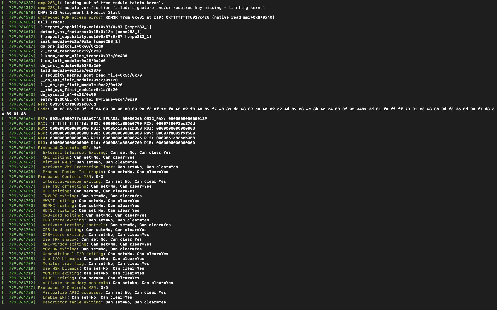

## Assignment 1

### Q1: 
 - Kaushal Karinaga Shetter Raju 015721238, Siddh Patel 015934074
 - We decided to work together throghout the project and did not split the work globally. Each person, at the end, had similar contribution and context. 

### Q2: Steps 
    ```
        - Clone the kernel
        - git clone https://github.com/torvalds/linux.git
        - sudo apt-get update
        - sudo apt-get -y install openssh-server git build-essential kernel-package fakeroot libncurses5-dev libssl-dev ccache libelf-dev bison flex
        - cd linux/
        - modify kernel code as per assignment
        - make oldconfig
        - make prepare
        - make
 	- make install
        - reboot back into same folder
        - insmod cmpe283-1.ko
        - dmesg and see the output
    ```

## Assignment 2
- Your assignment is to modify the CPUID emulation code in KVM to report back additional information when special CPUID leaf nodes are requested.
- For CPUID leaf node %eax=0x4FFFFFFF:
	- Return the total number of exits (all types) in %eax
- For CPUID leaf node %eax=0x4FFFFFFE:
	- Return the high 32 bits of the total time spent processing all exits in %ebx
	- Return the low 32 bits of the total time spent processing all exits in %ecx
	- %ebx and %ecx return values are measured in processor cycles, across all VCPUs

### Q1: 
 - Kaushal Karinaga Shetter Raju 015721238, Siddh Patel 015934074
 - We decided to work together throghout the project and did not split the work globally. Each person, at the end, had similar contribution and context. 

### Q2: Steps 
 -  Run following command on host machine
    ```
        - sudo make INSTALL_MOD_STRIP=1 modules_install && make install
	    - sudo rmmod -f kvm_intel
	    - sudo rmmod -f kvm
   	    - sudo modprobe kvm
        - sudo modprobe kvm_intel
    ```

### Q3: 
 - # of exits are sporadic, during certain operations there is a spike on # on number of exits. 
### Q4: 
 - External interrupt, cpuid, hlt, wrsmsr, cpt violation in order of decreasing frequency

### Test
- Steps to create nested virtual machine to test
	- Follow this wonderful guide to install your virtual environment
	- https://linuxize.com/post/how-to-install-kvm-on-ubuntu-20-04/
	
- Run the following commands inside the nested VM
	```
		sudo apt-get install cpuid
	```
	-  Total exits in nested VM
	```
		cpuid -l 0x4FFFFFFF	
	```
	-  Get total time processor cycles
	```
		cpuid -l 0x4FFFFFFE
	```
## OUTPUT
   - Assignment 1 output: 
   - 
   - 

   - Exit Output: 
   - 
   - 
   - 
  
   - Processor cycle output:
   - 
   - 
  
