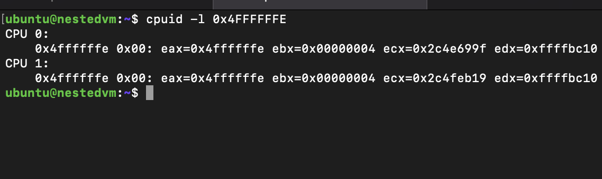

## Assignment 1

### Q1: 
 - Kaushal Karinaga Shetter Raju 015721238, Siddh Patel 015934074
 - We decided to work together throghout the project and did not split the work globally. Each person, at the end, had similar contribution and context. 

### Q2: Steps 
    ```
        - Clone the kernel
        - git clone https://github.com/torvalds/linux.git
        - sudo apt-get update
        - sudo apt-get -y install openssh-server git build-essential kernel-package fakeroot libncurses5-dev libssl-dev ccache libelf-dev bison flex
        - cd linux/
        - modify kernel code as per assignment
        - make oldconfig
        - make prepare
        - make
 	- make install
        - reboot back into same folder
        - insmod cmpe283-1.ko
        - dmesg and see the output
    ```

## Assignment 2
- Your assignment is to modify the CPUID emulation code in KVM to report back additional information when special CPUID leaf nodes are requested.
- For CPUID leaf node %eax=0x4FFFFFFF:
	- Return the total number of exits (all types) in %eax
- For CPUID leaf node %eax=0x4FFFFFFE:
	- Return the high 32 bits of the total time spent processing all exits in %ebx
	- Return the low 32 bits of the total time spent processing all exits in %ecx
	- %ebx and %ecx return values are measured in processor cycles, across all VCPUs

### Q1: 
 - Kaushal Karinaga Shetter Raju 015721238, Siddh Patel 015934074
 - We decided to work together throghout the project and did not split the work globally. Each person, at the end, had similar contribution and context. 

### Q2: Steps 
 -  Run following command on host machine
    ```
        - sudo make INSTALL_MOD_STRIP=1 modules_install && make install
	    - sudo rmmod -f kvm_intel
	    - sudo rmmod -f kvm
   	    - sudo modprobe kvm
        - sudo modprobe kvm_intel
    ```

### Q3: 
 - # of exits are sporadic, during certain operations there is a spike on # on number of exits. 
### Q4: 
 - External interrupt, cpuid, hlt, wrsmsr, cpt violation in order of decreasing frequency

### Test
- Steps to create nested virtual machine to test
	- Follow this wonderful guide to install your virtual environment
	- https://linuxize.com/post/how-to-install-kvm-on-ubuntu-20-04/
	
- Run the following commands inside the nested VM
	```
		sudo apt-get install cpuid
	```
	-  Total exits in nested VM
	```
		cpuid -l 0x4FFFFFFF	
	```
	-  Get total time processor cycles
	```
		cpuid -l 0x4FFFFFFE
	```
## OUTPUT
   - Assignment 1 output: 
   - 
   - 

   - Exit Output: 
   - 
   - 
   - 
  
   - Processor cycle output:
   - 
   - 

## Assignment 3
### Q1:
  - Kaushal Karinaga Shetter Raju 015721238, Siddh Patel 015934074
  - Kaushal Karinaga Shetter Raju - 0x4FFFFFFC
  - Siddh Patel - 0x4FFFFFFC

### Q2:
  - Assignment 3 is a continuation of Assignment 2, therefore the steps are the same, with the exception of the CPUID leaf node in the inner VM.
  - Implement CPUID leaf nodes 0x4FFFFFFC and 0x4FFFFFFD in the Linux kernel's cpuid.c and vmx.c files.
  - Command in the inner VM:
    - cpuid -l 0x4FFFFFFC
    - cpuid -l 0x4FFFFFFD
  - Here are the results:
    - 
    - 
  - Here are the results from host (dmesg): 
    - 
    - 


## Assignment 4
### Q1:
  - Kaushal Karinaga Shetter Raju 015721238, Siddh Patel 015934074
  - Kaushal Karinaga Shetter - Switched KVM to shadow paging (ept=0)
•	Executed the previous assignment and took for Shadow Paging (ept = 0). 
  - Siddh Patel - Executed the previous code of assignment and took the output for Nested paging (ept = 1). 
### Q2: Steps
  - Steps:-
 
Checked if the previous assignment was functional.

Step 1: Open Vmware and start virtual machine for starting linux.

1.	Use command, dmesg 

Step 2: To switch from nested paging to shadow paging, we can use following commands:-
	
-	sudo rmmod kvm_intel && sudo modprobe kvm && sudo modprobe kvm_intel ept=0 && sudo rmmod kvm 
-	Now we need to Reboot the system.

Now we can use dmesg (not using Shadow paging) :-

3.  Number of Exits
- In shadow paging, maximum exit occurred of type “CR_ACCESS " from our observation.
- INVLPG exit is present in case of shadow paging too.

4.  The changes between two runs (ept vs no-ept)

Shadow Paging (ept=0)
-  The VM exits for the INVALPG
-  There is a significant increase in count of exits for reason CR_ACCESS
-  Exit count for XSETBV

Nested Paging (ept=1)	
- The VM exits for EPT_VIOLATION
- The VM exits for EPT_MISCONFIG

-  In Shadow Paging, the count of exits significantly increased for CR_ACCESS reason as the hypervisor is taking exit on access of CR register.

### Output: 
  - With EPT (Nested Paging)
    - 
  - Without EPT (Shadow Paging) 
    - 

  
